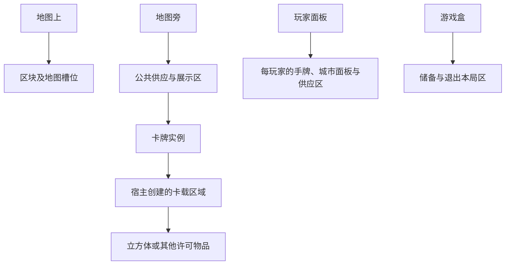

# 区域、物品与操作域设计

2026-10-02 · 扩展实装前的设计稿，尚未实现。本稿承接用户的四根区域、物品与区域混合组成、DIY操作域继承，以及[以标记位置为权威的设计](Lua效果系统API初稿.md#241-以标记位置为权威的区域模型2026-10-01-设计方向)。本轮仅修改文档。

Lua仍是无持久局部状态的Effect生成器；C#负责类型、权限、候选、提交和恢复。区域结构与Effect树是两套不同关系，前者回答“东西在哪里”，后者回答“规则怎样执行”。Effect统一和迁移顺序见[最小Effect统一与区域迁移计划](最小Effect统一与区域迁移计划.md)，总体调度以[Lua效果树与回合主链设计](Lua效果树与回合主链设计.md)为准。

## 1. 采用四根容纳结构，集合查询与关联关系分开

区域不是只能装最小物品的平面列表。采用四根的容纳森林：**地图上、地图旁、玩家面板、游戏盒**。每个物品实例只有一个直接所在区域，每个非根区域只有一个结构父节点，所有节点最终可追溯到四根之一。父区域可以同时有物品成员和宿主创建的子区域。

允许的结构包括：`区域→区域`、`区域→物品`、`物品→附属区域`。例如公共样式区包含样式牌，样式牌包含可用/已用标记区，这些区再包含立方体。卡牌因此可以是容纳结构的中间节点，不能假定所有物品都是叶子。

这里的“集合”有三种不同用途：

| 结构 | 用途 | 是否表示物理位置 |
| --- | --- | --- |
| 容纳父子关系 | 物品位于哪个区域，卡上或牌下区域跟随哪个载体 | 是；唯一位置的事实源 |
| 查询集合/索引 | 所有己方影响力、全部蓝色设施、本回合可用标记 | 否；从权威位置、类型及状态推导 |
| 关联边 | 航道连接资源点、设施十字相邻、token绑定城市、卡牌绑定设施 | 否；另存稳定引用，不制造第二份容纳位置 |

同一实例可以出现在多个查询结果里，但只能处于一个区域。`ZoneRef`表示容纳区域；旧`RegionRef`继续专指地图计分区块，避免中文“区域”让这两者混用。地图的道路网络及规则绑定可以是图，容纳结构本身必须无环。



图示不是固定深度。只有出现独立容量、可见性、顺序、操作资格或规则状态时才拆子区域；仅为美术位置多一个Transform，不增加规则区域。

## 2. 四根及内建子区域

以下路径用于说明结构，不作为运行时ID生成算法。实际ID采用项目稳定ID合同，显示名称和图片坐标不参与ID。

```text
地图上
├─ 各计分区块
│  ├─ 资源点
│  │  ├─ 影响力槽位区
│  │  ├─ 城市停靠区
│  │  ├─ 资源点指示物区
│  │  └─ 地图token区
│  └─ 航道
│     ├─ 影响力槽位区
│     ├─ 公路区
│     └─ 被覆盖标记区（保留物品，但不再是影响力）
├─ 分数轨道
└─ 其他地图级指示物区
地图旁
├─ 公共供应区
│  ├─ 资源供应/银行
│  ├─ 设施牌堆及设施供应槽
│  ├─ 干员牌堆及其候选/展示区
│  ├─ 各色事件牌堆及展示/弃置区
│  ├─ 企业家候选、授勋、流形、科室等专属池
│  └─ 公司标记、合约、公路及其他公共配件供应
├─ 企业合作板区
├─ 城市样式区
├─ 起始玩家等公共指示物区
└─ 结算暂存区（宿主按Effect创建有用途和生命周期的子区）
玩家面板
└─ 每位玩家
   ├─ 手牌区、弃牌区、盖放区、持续牌区
   ├─ 企业家能力及已选抉择区
   ├─ 城市面板设施格
   ├─ 玩家供应堆（普通玩家标记、帮派、储备设施等分子区）
   ├─ 资源持有区
   └─ 待执行物品/骰子区（确需玩家侧暂存时创建）
游戏盒
├─ 本局未启用/未选组件储备
└─ 明确回盒的退场物品
```

### 2.1 地图应细分到哪一层

区块→资源点/航道保留。资源点内的城市、影响力、指示物和token有不同占位规则，至少需要不同用途的槽位或子区。影响力槽位已有稳定ID时不必每格都再建立一个区域实例，可以用`ZoneRef＋slotId`表达。没有独立占用/数量规则的装饰格不建区。

当前[MapDefinition](../../Assets/YC/Domain/Maps/MapDefinition.cs)给地点与航道各一个`RegionId`，作为唯一结构归属。用户已裁定航道属于单一区块；航道端点、覆盖地点等拓扑关联不形成第二个所属区块。锁定及区控按唯一所属区块查询，不能将同一航道及其标记同时归到两侧区块。

分数轨道是地图级区域，不硬塞进某个资源点。负分和跨圈分数仍保留数值/圈数合同；不能仅凭轨道上一个格位还原全部分数，也不能为满足“标记决定数据”截断负分。

### 2.2 公共供应与其他地图旁区域

设施、干员、事件等牌堆统一归公共供应区。已摆出的企业板、样式及公共指示物另列展示区；是否可被取得由操作域决定，不因它们在地图旁就一律可拿。设施供应是稳定槽位，每槽可含有序牌层，与牌堆是不同区域。

授勋、公司标记和合约在对应专属池，实际取得后移入持有者或地图区域；不把“供应归谁”和“物品属于谁”混成一个玩家字段。牌堆不是第五个根，是具有顺序和抽取合同的一种区域。

抽取候选、事件展示、影响力离场待定去向等物品，若已离开原区，就必须进入宿主暂存区；`Effect.result`中的ID只是引用，不是第五种隐形存放处。暂存区必须记录所属Effect、允许物品、可见性、最终去向和清空条件，恢复不得重复抽取。

### 2.3 玩家及游戏盒

每玩家供应是区域集合，不再只等同“还能用几个普通影响力”。供应里的普通玩家标记、帮派标记、专属设施和牌上存放标记是不同集合。玩家对象仍保存身份、资源规则、行动状态等数据，但位置可推导的供应数量、使用资格及合作等级只保留查询/投影。

游戏盒的储备和明确退场分开，二者取回许可不同。定义目录及未创建为本局实例的安装素材不是实体，不必虚构几百张卡全部放入盒子。本局已创建的每个实例则必须有位置。没有写取回的效果不能从退场区随意拿牌；明确许可再获得时才用对应操作合同。

## 3. 物品身份、物理类别与操作域

### 3.1 四种基础物理类别

对外定义先限定物理类别为`Cube`立方体、`Card`卡牌/卡面板片、`MobileCity`移动城市、`Token`其他指示物。这是软件分类；不依赖模型网格是否真是立方体。骰子、资源点牌片、公路、资源配件等可以是注册的Token子类，企业板、科室板等可作为Card板片子类；地图及玩家容器由宿主结构区域表示。

```text
Cube
├─ PlayerMarker：具有玩家标记资格
├─ GangMarker：帮派立方体，没有玩家标记资格
└─ CompanyMarker：公司立方体，不伪装成玩家所有者
Card
├─ FacilityCard
├─ CharacterCard
│  ├─ BasicCharacterCard
│  ├─ OperatorCard
│  └─ GeneratedCharacterCard
├─ EventCard / AwardCard / EntrepreneurCard
└─ BoardCard（企业/科室/样式等可挂区域的卡面板片）
MobileCity
Token
├─ RoadToken / ResourcePointToken / DiceToken
├─ BoundLocationToken
└─ DIY注册的Token子类
```

这棵类型图是建议，不要求C#按此创建继承类，更不开放CLR继承给Lua。用加载器登记的类型ID、基类型ID和操作合同构成定义目录即可。每个实体始终保留`itemId`、定义和本质类型，移动后不变。

### 3.2 “影响力”是位置及资格形成的角色

**影响力不是每枚立方体永远具有的本质类型。**能够成为影响力的物品，处于合法地图影响力槽且未被覆盖、拥有适用影响力操作合同，才加入当前影响力查询。立方体移到供应、能力牌或多萝西牌上后不再是影响力；它仍保留原标记类型、所有者与实例ID。

```text
帮派标记G1在保罗供应：Cube / GangMarker，非影响力
  → 放置影响力
G1在地图影响力槽：Cube / GangMarker，具有帮派影响力角色
  → 移除并选择收留到多萝西
G1在多萝西卡载区：Cube / GangMarker，非影响力
```

多萝西收留区因此接受**立方体**，入口同时检查“本次离场的己方影响力”等卡面资格。初始“放至多4个玩家标记”仍筛选普通玩家标记，不能因容器能放立方体就把初始投入也扩大成任意配件。牌上没有4枚总容量限制。帮派存入后不变成玩家标记，也不能拿去支付写明“玩家标记”的诗怀雅操作；从牌上移出立方体同样不等于地图影响力被移除。

公司归属主体、帮派类型、普通玩家标记资格和城市区控贡献也分开。城市可以在区控算法中贡献影响力数量，但不是影响力槽内的立方体，不能因此成为普通`RemoveInfluence`目标。

### 3.3 DIY必须声明继承哪个操作合同

“可操作域”定义：某类物品在什么来源/目标区域、什么角色状态下，允许通过哪些**宿主注册的操作**被选择、移动、取得、消耗或计数。物理类别、静态子类型和操作域分别声明，不能用一个标签混包。

| DIY需求 | 应声明的继承/复用 | 不自动继承的规则 |
| --- | --- | --- |
| 新玩家标记 | 基类型PlayerMarker，沿用玩家标记身份、供应、所有者和存放合同 | 不能忽略数量守恒，不能自行改变企业等级奖励 |
| 帮派标记 | 基类别Cube、帮派子类型，具有注册的“可作为影响力来源”合同 | 不继承PlayerMarker资格，诗怀雅和指令/声望投入仍按各自类型过滤 |
| 新设施牌 | 继承FacilityCard操作域，允许其合法供应、图纸、建设与城市区域 | 建设收费、唯一性、分层和入场不能用纯移牌绕过 |
| 新干员/基础角色 | 分别继承OperatorCard或BasicCharacterCard，再共享CharacterCard使用合同 | 干员不自动发到所有人初始手牌；生成角色也不自动进入干员池 |
| 新移动城市 | 继承MobileCity合同，并声明所属玩家与合法停靠范围 | 不以Token同名标签冒充城市，不任意突破停靠与移动链限制 |
| 嘉维尔式token | 基类别Token，复用宿主“资源点相邻移动”路径合同；另设token自己的占位/移动操作域 | 不占城市位/影响力槽，不自动付城市费、清影响力、留影响力或翻事件，不发布CityMoveCompleted |

建议对外字段包括`baseTypeId`和`operationProfileIds`。类型继承单父且无环；基类型提供默认操作域，新类型可选择许可组合或进一步收窄，不能通过不填基域约束解除限制。操作能力可以组合，但每种组合和参数由宿主注册表许可。脚本不能任意添加一个自称`influence`或`mobile_city`的字符串就获得能力；基域中的硬约束只能继承，卡面候选修正按既有Candidate合同调整可变部分。

嘉维尔token按用户I-Q14裁定不会离场，创建后持续保存同一实例与位置；不能因角色普通卡区变化自动回收。相邻/开放/航道候选的具体实现使用宿主注册的拓扑合同，不由“像城市移动”擅自增加规则。真正共享的是拓扑选择及移动提交机制，完整城市行动的附带规则保留在城市流程里。

## 4. 区域定义：物品许可对外，结构创建由宿主控制

### 4.1 两层接口

用户要求“外部不能直接定义一个可以放区域的区域”，按以下方式落实：

- 宿主内部区域模板定义结构父节点、允许的结构子区域及创建生命周期。
- 外部内容只能给**已有注册模板**填物品许可、用途和卡载配置。`acceptedItemKinds`只接受四种物理类别及已登记子类型过滤，没有`Zone`或`Any`。
- 外部不能填写任意父区ID、`acceptsZones=true`、移动子区域或替换四根。需要公共奖励池、图纸、标记轨道或牌下区时，声明模板及配置，由C#按内容/玩家实例创建并挂到许可锚点。
- 区域引用可以成为查询/选择目标，但不是可用`MoveItem`移动的物品。复制卡面定义不复制本局卡载区中的实际物品。

宿主能创建`区域→区域`不表示外部区域的物品过滤器允许区域。两类入口分开，外部JSON中的结构节点必须由宿主工厂产生；加载时不能因为长得像一个区域DTO就接受它。

### 4.2 最少定义字段

以下为拟议schema字段，不是已有加载格式。

| 字段 | 必须表达的内容 |
| --- | --- |
| `zoneTemplateId`、`localZoneId` | 已注册模板及载体实例内唯一名称；不使用显示文字定位 |
| `acceptedItemKinds`、`acceptedTypeIds` | 允许物品类别/子类型；过滤逻辑使用固定匹配模式，不能由脚本扩大到区域 |
| `entryPolicyId`、`exitPolicyId` | 注册的来源、所有者、资格及退出规则；可容纳不等于可主动放入 |
| `capacity`、`slotSchemaId` | 可选容量与稳定槽位；无容量上限需显式声明，不把首次投入上限当容量 |
| `orderingKind` | 无序集合、有序牌堆、固定槽、设施层叠或轨道；每类由注册模板定义合法操作 |
| `visibilityPolicyId` | 数量、实例身份、牌面、顺序与区域本身分别如何可见 |
| `rolePolicyId` | 物品在该区域中形成的角色，如有效影响力、能力存量、企业等级、已使用状态 |
| `carrierExitPolicyId` | 载体移动、回盒或失效时，内容随行/返还/分别退出的注册策略 |
| `displayAnchorId` | 仅作资产绑定；不能让UI位置修改权威区域 |

### 4.3 区域许可实例

| 区域 | 接受物品 | 额外合同 |
| --- | --- | --- |
| 地图影响力槽 | 可作为影响力来源的Cube子类 | 归属、城市、公路、空槽和卡面限制仍复验；同一槽不能重复占用 |
| 资源点城市区 | MobileCity | 按实际移动模式复验停靠资格；嘉维尔Token不占此容量 |
| 资源点token区 | 注册地图Token类型 | 资源点指示物、锁定、嘉维尔各有用途及数量规则 |
| 多萝西卡载区 | Cube | 初始投入限玩家标记；收留限真实离场己方影响力；卡面没有4枚总容量 |
| 诗怀雅玩家标记区 | PlayerMarker子类型 | 可存其他玩家标记但保留原所有者；帮派Cube不能进入 |
| 指令/声望/企业等级区 | PlayerMarker子类型 | 所有者、取得费用、轨道迁移或永久回盒按能力合同 |
| 马丁图纸/可露希尔牌下 | FacilityCard子类型 | 来源许可与后续建设资格分别校验，不能只看Card大类 |
| 公共设施牌堆 | FacilityCard子类型 | 有序、隐藏；洗混只改变本区序列，不自行收集其他区域卡牌 |
| 城市面板设施格 | FacilityCard子类型 | 存有序层；下层仍存在，顶层参与规则按具体查询决定 |
| 玩家手/弃/盖/持续角色区 | CharacterCard许可子类型 | 盖牌槽类型、一次性/持续生命周期、公开性分别校验 |
| 游戏盒退场区 | 本局可退场的四类物品 | 进盒不改本质类型或抹除所有者；取回需明确规则授权 |

### 4.4 外部定义入口示意

以下是拟议JSON片段，只展示结构，不是当前pack.json可加载格式。ID名称也只是建议；宿主实现并登记模板/操作域后才能使用。包声明类型及卡载区，C#按本局实例创建区域并分配父节点，JSON不填任意父区。

```json
{
  "itemType": {
    "typeId": "infected.gang_marker",
    "physicalKind": "Cube",
    "baseTypeId": "core.cube",
    "operationProfileIds": ["core.cube_storage", "core.influence_cube"],
    "classificationTags": ["gang"]
  },
  "cardZones": [
    {
      "localZoneId": "stored-cubes",
      "zoneTemplateId": "core.card_cube_storage",
      "acceptedItemKinds": ["Cube"],
      "entryPolicyId": "core.explicit_or_removed_owned_influence",
      "exitPolicyId": "core.card_cube_payment",
      "orderingKind": "unordered",
      "capacityPolicy": "unbounded",
      "visibilityPolicyId": "core.public_stored_items",
      "carrierExitPolicyId": "core.return_contents_before_exit"
    }
  ]
}
```

示例把帮派的物理类型和多萝西式存放区放在一起便于对照，实际分别属于各自定义。`classificationTags`仅用于已注册分类查询，不能凭标签获得玩家标记资格。多萝西初始最多4枚在激活效果数量合同中填写，不在该区capacity里填4；收尾支付及载体离场返还规则仍须按正式卡面核定，示例策略ID不是新增裁定。

能力用只读ZoneRef/ItemRef查询候选，并返回移动/业务Effect；外部定义接口不能直接写zoneId或实例序列。新Token继承`core.token`并选择许可路径操作域；如果新物品需要目前没有的语义操作、区域模板或状态字段，声明所需能力版本，宿主未支持时在装配阶段明确报缺能力，不能靠Lua自造执行器。

## 5. 权威状态与引用建议

```text
GameState
├─ itemInstances[]
│  ├─ itemId / definitionId / typeId / physicalKind
│  ├─ ownerSubject                    # 属于谁，可是玩家、公司或无主体
│  ├─ controllerSubject               # 谁当前持有/控制，与所有者分开
│  ├─ zoneId / slotId                 # 唯一直接位置
│  └─ itemState                       # 面、朝向、绑定等类型化值
├─ zoneInstances[]
│  ├─ zoneId / templateId / localZoneId
│  ├─ parentKind = zone | item | root
│  ├─ parentId                        # parentKind为item时就是载体ID
│  └─ runtimeConfiguration            # 必要的有限类型化配置
├─ orderedZoneStates[]                # 仅有序区域：itemIds的权威排列
├─ relationStates[]                   # 拓扑/绑定；不当第二位置
└─ effectRuntime                      # 保持已有树、提交及响应合同
```

`ZoneRef={zoneId}`，`ItemRef={itemId}`，槽位引用另带`slotId`。来源定义、版本和展示名字从本局目录解析，不将整份定义塞进每次操作参数。区域ID随卡载体移动保持稳定，不用含当前玩家路径的字符串作为身份。

成员关系以物品的直接`zoneId`为准，区域成员列表为可重建索引。有序区域的`itemIds`只负责顺序这一不可派生事实；其集合必须恰好等于该区实际成员，每项一次。不能再让物品另存一个可写牌堆下标；下标从序列推导。槽位位置和牌堆顺序也不能混用。

玩家供应数量、牌上计数、企业合作等级、样式使用次数及影响力集合由位置和注册规则推导。旧字段只读兼容投影不能独立加减。已支付、已发即时奖励、角色能力激活、宣告参与设施、回合频率等历史事实仍保留于实例或Effect记录，不因当前位置相同就重发奖励。

持久数据使用DTO和List，不保存接口实例、委托、任意Dictionary/object、Lua对象或Unity引用。查询和UI投影可做缓存，但必须绑定revision并可重建。供给数量有单独身份意义的Cube逐枚建实例；可互换资源配件可以用类型化Token数量批次表示，资源余额由批次或唯一资源账本推导，不能保留两套独立可写余额。

无限公路供应采用明确的无限供应源合同，在实际放置时分配新的稳定RoadToken实例并记录生成提交；不预创建无限个实例。有限帮派、公司和玩家标记不能用这个合同补造。

## 6. 转移、携带与语义事件

### 6.1 通用转移的边界

通用物品转移校验身份、当前源区、目标许可、数量/容量、槽位/顺序、操作域、调用权限和本次候选。一组不可拆要求在同一RuleCommit完整提交，源区减员与目标区增员不可分开发布。逐项尽量执行则由上层Repeat明确组织，并逐步刷新候选。

通用转移不等同建设、使用角色、影响力移动或完整城市移动：

- 入城市设施格需要建设/已许可设施操作，不能纯移牌跳过费用和入场。
- 地图影响力进入/离场/地图间移动走影响力操作合同。`MoveInfluence`一次搬同一实例，只有InfluenceMoved，不把内部离开进入拆成Removed/Placed。
- `ReplaceInfluence`继续保留移除、放置及完整替换事实；按原合同允许removed_only。存放模型不改变其失败语义。
- 城市停靠变更通过城市链或宿主专用设置合同；通用物品转移不能绕过清除、留标记及CityMoveCompleted响应。
- 简单存放、回手、回盒、牌堆底移牌等可复用统一转移，调用方仍声明正确的类型与操作许可。

通用ItemTransferred是位置审计事实，不能被脚本写一个`semanticEvent`参数改造成“已经建设/城市移动”。语义事件由注册操作合同产生，并带同一operationId及前后角色/位置快照。通用位置事件和业务事件同时存在时，订阅需明确监听哪一层，不能重复触发同一能力。

### 6.2 离场实例与响应

建议影响力离场使用宿主“离场待处理”暂存区：地图→暂存后已不计影响力，发布实际InfluenceRemoved并等待响应；多萝西/第五号等按真实实例选去向，结束后未收留者才回合法供应。这样不会先加普通玩家供应数量再复制一枚到卡上。**这是待实装的响应流程设计，不是现有RemovalService行为。**

多个收留能力争用同一实例时，由本次离场上下文组织唯一去向选择，不能依靠订阅先后抢走，也不能两个能力各取得一份。替换的Removed/Replaced事件共享因果ID；同一“移除或替换时收留”能力对同一离场实例只处理一次。保罗1B移出的帮派随后放回原位置，继续引用原itemId和本次移除记录。

能力区移出标记不形成InfluenceRemoved；公路覆盖也不能伪造移除。官方先移除再放路照卡面流程，DIY单独放路则把仍存在的标记归到该航道被覆盖区/覆盖状态，退出影响力查询，不回供应。

### 6.3 卡牌附属区域及绑定

载体卡牌移动时，其附属区域仍挂载同一实例；区域及内容是否随行由注册的carrierExitPolicy决定。卡牌回盒前若规则要求返还标记/移走牌下设施，必须先执行并等待这些操作，不能删区域抹掉内容。未登记离场合同的带内容区域卡牌不能任意移动到新环境。

规则允许内容随行时，根归属由载体新位置推导，所有物品ID、标记原所有者和本质类型不变。新根的可见性与附属区域规则共同复验，不把公开他人标记暗藏到非法私有区。设施层叠用同一城市格或供应槽的有序成员，不把下层牌错误挂成顶牌子物品。

绑定是另一种关系。锁定token绑定城市后仍位于地图token区，随城更新位置要由注册移动响应提交；不是成为城市停靠槽的成员。涤火与设施绑定也不自动建立容纳关系或把卡牌移进设施内。

锁定token的生命周期和嘉维尔token分别注册：锁定在紧接的下一行动轮开始移除，可以是本回合第2轮或下回合第1轮；嘉维尔token不会离场。杰西卡与建成设施实例的绑定是逻辑关系，详情显示卡面金券费用+2并提供收尾结算项，不要求把角色摆进城市面板。赫拉格新盖角色时新增盖牌槽，不用转移旧盖牌实现；流形继承角色及手牌操作资格。

## 7. 对外查询、可见性与恢复

拟议只读查询包括`GetZone`、`GetItem`、`FindItems`、`FindZones`、`GetAncestors`以及按区域用途查找引用。默认只看直接成员，`scope=descendants`需显式且受权限及结果上限限制，不能因父区公开就列出所有子区隐藏牌序。以上尚未加入宿主。

每次查询绑定LuaInvocationContext的revision。Host按同一位置模型生成候选并在回答时复验。Candidate.Add只能在该Effect可操作域的候选池里增加候选，不能扩大物理类型、区域权限、容量或伪造未登记的新物品。

权限分别检查区域存在、数量、实例ID、牌面、序列和物品状态。知道牌堆数量不代表知道下一张；卡牌在盒里也不自动公开秘密裁牌身份。操作公开性取注册合同；外部参数只能在许可范围内声明，不得自行设“全部公开”。

存档校验：四根存在且唯一；全部物品和区域可达；无重复位置、环和非法类型；有序区成员一致；有限组件数量守恒；暂存区有有效所属Effect；规则目录版本一致。已提交转移、随机结果和事件收据恢复时沿用，不因重建索引重新发布事件。

## 8. 准备与验收边界

本稿给出结构和合同，不新增运行字段或替用户决定尚未明确的卡牌规则。多萝西存放帮派Cube按本次用户说明确定；第五号普通支付返还、马丁层叠揭露/补牌、载体覆盖后的能力活动、嘉维尔路径规则等仍见各扩展待确认表。

实现前应以基础局、企业局、感染者基础、感染者企业家模式分别形成设置配方，检查实际创建物品都在四根中。区域定义和操作域是共同底座，不把企业家自动混入感染者基础。状态迁移、Effect API兼容、实施步骤及未来验收清单见[迁移计划](最小Effect统一与区域迁移计划.md)。
