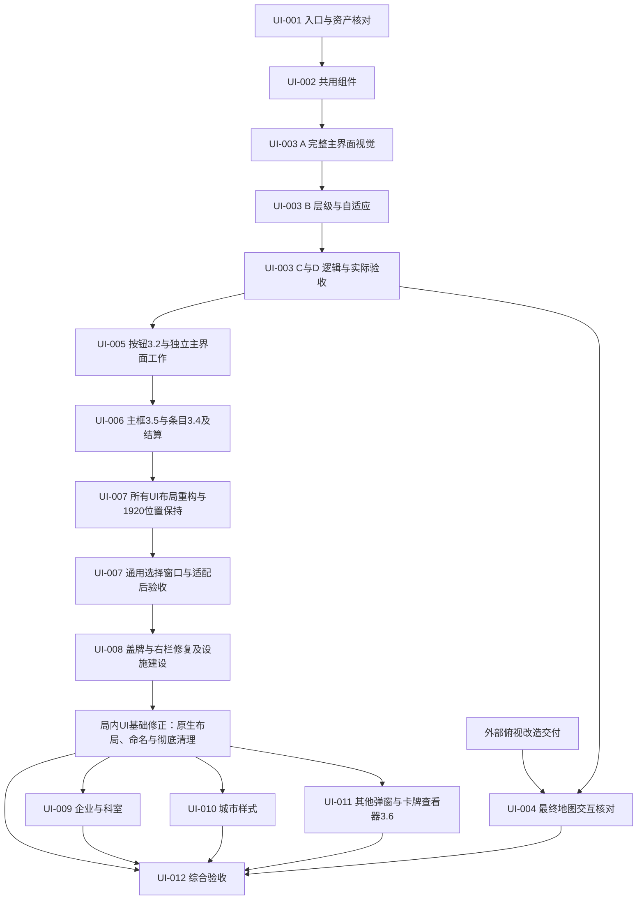

# UI 更新实施计划

**2026-09-26 审查修订：**执行前先读[原生布局、语义命名与彻底清理规范](07-原生布局命名与旧UI清理纠正规范.md)。普通结构采用原生行列布局；禁止按比例隐藏主列或新增分区换页；生产名称按功能命名；旧翻面及“查看提示／上下文按钮”必须删除。后续实施先完成[局内 UI 基础修正](局内UI基础修正执行提示词.md)，旧的相反描述已撤销。

更新日期：2026-09-26。状态：UI-001～UI-008（不含暂缓的 UI-004）已有各自范围的交付记录。最新审查确认原生布局、生产命名、旧 UI 清理和主分区分页仍需纠正；下一步先执行[局内 UI 基础修正](局内UI基础修正执行提示词.md)，再继续 UI-009～UI-011。既有业务成果与未验证项分别保留，不能用旧的完成标记或截图数量证明本次纠正已完成。所有修改限于局内，保持正常 1920×1080 位置；UI-004 等待俯视改造。

本计划在现有素材整理结果上新增执行安排，保留原文档。核心目标是接入新版素材、统一对局界面交互，并让不同大小和比例的窗口都能正常操作。

本次新增[单页面与字体补充规范](02-单页面与字体补充规范.md)，落实 UI-001 完成后的用户要求。后续以该规范约束页面切换、effect 页恢复和五种字体使用；[UI-001 原记录](执行记录/2026-09-24_UI-001_接入基线.md)保留其当时的核对结论。

2026-09-25 新增[视觉搭建优先规范](03-视觉搭建优先与分阶段验收.md)：每个界面按“素材依据 → 原生布局中的完整基准视觉 → 层级与填充核对 → 业务逻辑 → 就绪后实际验收”推进。UI-003 先完成主外框与所有主模块视觉，不能只给旧桌面添加顶底栏后开始整页验收。布局容器从搭建开始生效，不再先用绝对位置摆完后补空壳组件。

同日，在用户确认 UI-003 完成后收到 MainButtons 3.2。新增[按钮增量规范](04-主界面按钮3.2增量规范.md)及 [UI-005 补充提示词](UI-005-补充-主界面按钮3.2.md)。随后用户说明世界地图将由其他人改成俯视，新增[05 任务安排](05-地图俯视改造期间的任务安排.md)：当前顺序为 UI-003 → UI-005，UI-004 待俯视改造后恢复。UI-005 在业务接线前先完成新按钮的视觉与层级，地图端到端部分明确留待补验。

2026-09-25 进度：用户确认 UI-005 完成，并新增 EffectRows 3.4 与 MainFrame 3.5。[06 增量规范](06-效果条目3.4与主框3.5增量规范.md)和 [UI-006 补充提示词](UI-006-补充-效果条目3.4与主框3.5.md)将新增工作接在 UI-005 之后：先主框、再共用行及宿主视觉，然后层级适配、结算业务与验收。此段作为演进记录保留。

2026-09-26 早先安排：用户要求将布局纠正放在 UI-006 之后，形成 [UI-007 布局补充](UI-007-补充-布局结构与自适应重构.md)。该要求后来限于所有局内 UI，正常 1920×1080 屏幕位置保持不变；修复玩家明细展开导致的城市越界，适配完成后再验证其他尺寸。

2026-09-26 本次审查进一步撤销“普通区域可以用任意自定义布局替代”“按比例隐藏主列再换页”“旧翻面改成查看提示即可保留”等解释，明确原生布局、语义命名和彻底清理。详见[纠正规范](07-原生布局命名与旧UI清理纠正规范.md)与[审查记录](执行记录/2026-09-26_UI任务文档全面审查.md)。新增 CardViewer 3.6 归入 [UI-011 补充](UI-011-补充-卡牌查看器3.6.md)，其素材接入不应掩盖基础问题。

## 1. 已有依据与边界

### 当前执行入口：局内 UI 基础修正

保留 UI-008 已接入的盖牌选择与建设业务，先从实际资产清单完成根 VLG／中间 HLG／列内 VLG、全局内页面填充、取消所有尺寸触发的主分区换页、语义命名迁移及旧 UI 删除。旧翻面所需的真实第二效果决定迁入新版 effect 页；旧弃牌预览由新版只读入口承接。完成条件是新结构和新入口成立、旧路径实际消失，不能以“停用／改名／后续再删”结项。

这是原 12 项任务之间新增的纠正阶段，不重新编号历史，也不重做已正确接入的业务。UI-009～UI-011 以其实际交付的结构为前置；UI-008 历史未验证的业务项按原记录继续跟踪。

### 2026-09-26：UI-008 新增范围

承接 [UI-007 交付记录](执行记录/2026-09-26_UI-007_通用选择窗口.md)，同时执行 [UI-008 主提示词](UI-008-设施建设与报价联动.md)和[新增修复补充](UI-008-补充-盖牌选择右栏适配与旧UI清理.md)：

1. 盖牌阶段使用新版角色牌单选／确认 UI，正式接入原盖牌命令并替换拖动放置。
2. 修复整个右栏及三个页签的纵向填充，宽度变化时重新计算当前可用高度；第三页的布局在本项处理，完整城市样式换新仍由 UI-010 承担。
3. 迁移必要功能后删除旧资源计数器、翻转按钮和弃牌区，重点拆分计数器刷新对手牌／建设的依赖、保留第二效果结束操作与弃牌查看能力。

先完成布局与完整视觉，再接正式逻辑和替代入口、清理旧 UI；原建设与报价迁移继续。适配完成后才做定向尺寸核对与正式矩阵。UI-007 执行中已明确排除非局内界面，后续沿用局内资产隔离，不扩展到启动、加载、房间或收藏室。

### 1.1 素材版本

入口为 [整理版 README](../../游城拓荒/UI素材/整理版-2026-09-24/README.md)、[版本关系](../../游城拓荒/UI素材/整理版-2026-09-24/文档/01_版本与替换关系.md)、[资产目录](../../游城拓荒/UI素材/整理版-2026-09-24/资产目录.md) 和 [预览索引](../../游城拓荒/UI素材/整理版-2026-09-24/预览索引.md)。

| 范围 | 采用依据 | 实施注意 |
| --- | --- | --- |
| 主界面、顶栏、底栏、结算抽屉、通用框体及未被专项补丁覆盖的按钮 | `FrontierUI-v3-Patch` 的实际 3.1 组件；布局补丁字段仍写 3.0.0 | 以实际组件索引和包内内容核对，不仅看 ZIP 文件名 |
| 三个右下页签、六个主要行动、撤销与结束行动，共 11 个按钮 | `MainButtons-v3.2-Patch`，优先于上述按钮的 3.1 样式 | 见[增量目录](../../游城拓荒/UI素材/整理增量-2026-09-25-按钮3.2/README.md)；仅按用途覆盖，不全局替换同名共用按钮 |
| 选择执行条目、其他玩家永续明细、快速行动列表 | `EffectRows-v3.4-Patch` | [条目目录](../../游城拓荒/UI素材/整理增量-2026-09-25-效果条目3.4/README.md)；UI-006 搭一套共用行，后续窗口按请求语义复用，源 `v33-` 为兼容 ID |
| 主外框、底栏框、结算槽框、干净底栏底图 | `MainFrame-v3.5-Patch` | [主框目录](../../游城拓荒/UI素材/整理增量-2026-09-25-主框3.5/README.md)；四项精准替换，源切片与目标逻辑角区分开，旧框不叠加 |
| 卡牌查看与角色牌使用查看器 | `CardViewer-v3.6-Patch` 及配套布局文档 | [UI-011 详细补充](UI-011-补充-卡牌查看器3.6.md)；区分 inspect／use-character，按哈希复用原卡牌选择纹理，不导入整份网页演示 |
| 原卡、地图／城市内容、玩家标记和未替换控件 | `MainGameUI-v2.2` 及整理后的沿用资产 | 没有新版替代的内容保留；旧顶栏不重新引入 |
| 企业、设施、城市样式、科室、卡牌和选项窗口 | 各专用包的内容与交互说明，再适配新共用样式 | 新补丁只有新版主界面预览，不能当作已交付全部新版弹窗 |
| 企业窗口版本 | 包名 v1.0，实际 1.0.1 | 记录实际版本；不改原包 |
| 兼容组件 | `turn-tag`、`redzone-paper` 等 | 整理保留不等于主界面必须使用，按实际设计与数据入口选择 |

2026-09-24 整理版有 180 份去重图像、71 份原包 JSON 副本，原目录保留。新增 3.2 独立增量含 51 项逻辑按钮素材、153 份 PNG／SVG 源素材文件及其他说明／预览；不同口径的数量不能直接相加当作运行时资源数。仅导入实际所需资源。原包 `assetCount` 声明与实际组件数的差异已记录，以实际索引为准。

3.4 独立增量有 32 项组件素材＋15 个标记 PNG，共 111 份运行时源素材文件；3.5 有 4 项整图＋24 项可选拆片，共 84 份源素材文件。整图／拆片、1x／2x 为替代方案，不全部导入。3.4 的演示整份清单仍含旧主框，合并时以用途采用 3.5 四项覆盖，不能让旧框回退。

### 1.2 已核对的项目入口

| 入口 | 当前事实 | 对换新的影响 |
| --- | --- | --- |
| [GameplayInteractionHud.prefab](../../Assets/YC/Presentation/Prefabs/Gameplay/GameplayInteractionHud.prefab) | 同时包含屏幕 Canvas 和桌面 WorldSpace Canvas | 常驻栏与内容窗口需明确所属层级，不能随地图缩放 |
| [TabletopCanvasLayout](../../Assets/YC/Presentation/TabletopCanvasLayout.cs) | 桌面层依赖地图边界配置 | 新内容区布局须同步处理视口、地图相机和坐标映射 |
| [SampleScene](../../Assets/Scenes/SampleScene.unity)、[ThreePlayerScene](../../Assets/Scenes/ThreePlayerScene.unity) | 共用 HUD，地图资源不同 | 两个实际场景均要检查；执行前复核发布入口及场景覆盖 |
| [GameplayDialogRegistry](../../Assets/YC/Presentation/GameplayDialogRegistry.cs) | 提供正式弹窗引用和实例化入口 | 窗口换新应落到实际注册与运行路径 |
| [InteractionRequestRouter](../../Assets/YC/Presentation/Workflows/InteractionRequestRouter.cs) | 按玩家可见请求选择 renderer | 复用请求生命周期，不为每个新窗口建立独立规则状态 |
| [基础内容迁移与 UI 接入边界](../../docs/设计/基础内容迁移与UI接入边界.md) | 2026-09-21 记录主要行动仍有旧预选入口，部分扩展规则待定义 | 必须重新核对现状；UI 迁移不能默认所有底层能力已齐全 |

执行时以代码现状复核上述入口。这里的读取结果不代表运行验证。

### 1.3 UI-003 完成后的交接

- [UI-003 交付记录](执行记录/2026-09-25_UI-003_常驻栏与适配框架.md)及[视觉清单](执行记录/2026-09-25_UI-003_视觉清单.md)是后续基线。当前实际画面证据采用 `UI003-LayerFix-*`；原记录保留。本次整理只读取证据，没有重新运行 Unity。
- 主界面框体、顶底栏、统一层级、唯一页面及 effect 恢复已在框架范围交付。旧设施供应／格位仍有过渡 View；UI-005 可先迁移独立 UI 与真实主模块数据，城市格位在实际迁移任务中核对，世界地图精确命中和相关完整行动链待俯视改造后由 UI-004 补验。
- 当前旧行动六格包含使用角色牌／宣告样式，新素材六格包含建设／特殊行动；UI-005 按语义迁移并保留原可用功能，不能按旧按钮序号换图。详见 04。

## 2. 新要求对旧方案的修订

UI-005 最新交接：见[主界面接入记录](执行记录/2026-09-25_UI-005_主界面接入.md)。按钮 3.2、三页签、公开数量与手牌分页已交付；“使用角色牌／宣告样式”已有明确去向，建设已接原草稿入口。旧 1.3 节的按钮对照保留为 UI-005 迁移前的依据，当前以该记录为准。撤销、独立特殊行动、企业家／合作投影仍有规则缺口，地图完整提交及设备／联机验证仍待验。新增两个补丁接入不改变 UI-005 的完成状态。

| 原资料中的情况 | 本轮采用要求 |
| --- | --- |
| 旧层级把嵌套选择器／提示放在底栏之上 | 顶栏和底栏在所有对局内容窗口、嵌套选择、提示及拖拽之上，显示和输入同时保证 |
| 旧设计使用固定 1920×1080 矩形或整套等比缩放 | 保留参考构图；实际按安全区域、最小尺寸、伸缩约束和内容重排布局 |
| 部分旧弹窗下缘为 y=1012，新底栏从 y=986 开始 | 不照搬旧弹窗高度；统一约束在顶底栏之间的内容区，重排页脚和滚动区 |
| 旧建设窗口内含独立效果区 | 按新版素材语义迁到全局结算摘要／抽屉，复用同一操作上下文 |
| 现有部分窗口带标题栏拖动手柄 | 游戏内所有窗口不可拖动移位，位置由资产与自适应布局决定；内容滚动、卡牌拖拽和地图平移独立保留 |
| 先前方案允许主窗口、抽屉和子窗口叠加 | 同时最多一张可见页面；独立抽屉、详情和子选择替换当前页，或作为当前页内部区域／步骤 |
| 顶栏收起／展开曾沿用素材的主界面折叠语义 | 针对当前结算 effect 页：收起后查看其他资料，展开时关闭当前资料页并恢复有效 effect 步骤 |
| 字体只按通用中西文方案描述 | 按方正普通文字、汉仪强调文字、msyh 特殊字词、NarrowBold 效果数字、wide 纯 UI 数字分配 |
| 原先 UI-003 先接主框架逻辑，主模块整体迁移安排在 UI-005 | 将完整主界面视觉提前到 UI-003；外框和模块素材齐全后核对层级，再接业务逻辑，UI-005 复用已核对的结构 |

用户本次要求和本分类共同约束是本轮层级与适配的执行依据。旧资料继续作为版本和视觉参考保留。

## 3. 对局层级与输入方案

### 3.1 显示顺序

下表由低到高。实际 sorting 值在 UI-003 中集中配置，不能在每个控制器临时加数。

| 层 | 内容 | 输入边界 |
| --- | --- | --- |
| 1 | 地图、城市板及地图交互标记 | 位于实际视口；UI 命中时不向地图穿透 |
| 2 | 玩家、手牌、资源、合作区、牌堆和行动页签 | 内容区基础交互 |
| 3 | 当前唯一页面及其遮罩，可为 effect 页、独立抽屉、详情、设置或查看器 | 页面互斥；子选择切换步骤或替换当前页，遮罩仅阻挡内容区 |
| 4 | 内容工具提示、拖拽展示及临时提示 | 限于内容区；装饰默认不拦截射线 |
| 5（最高） | **常驻顶栏、常驻底栏及各自内部状态提示** | **独立输入分组；两栏始终可达** |

顶栏与底栏不重叠，无需争夺彼此优先级。栏内提示不得遮住另一项合法操作；大型帮助或详情放回内容窗口层。对局中的结束展示、断线提示、设置弹窗也遵守本约定。

### 3.2 输入规则

- `ContentRect` = 安全区域扣除实际顶栏高度、底栏高度及配置间距后的区域。当前唯一页面、其遮罩及内部结算／选择区域均约束在该区域。
- 内容模态锁定只影响内容分组。最高层 Canvas 根节点不放可命中的整屏透明底板。
- 点击、触摸、滚轮、焦点导航与拖拽捕获分别验证。UI 上的点击不继续触发地图；内容的指针捕获结束后正确释放。
- 结束行动／撤销根据当前会话能力禁用，其他合法功能保持可用。等待网络结果不整体锁死顶底栏。
- 所有能创建临时 Canvas 的窗口、拖拽和提示都使用统一层级策略；禁止通过扫描全部 Canvas 后取 `max + 1` 超过两栏。
- 顶底栏操作与当前页面共用请求版本校验。effect 页可收起并保留有效选择，关闭资料页后继续保持收起；点击顶栏“展开”才恢复当前有效步骤，不能恢复过期提交。
- 顶栏按钮只承担 effect 页收起／恢复。收起不取消、不提交 effect，隐藏页释放输入与遮罩；展开时关闭当前资料页再显示 effect 页。资料入口、子选择及独立抽屉都遵循同时最多一页。
- 所有窗口、弹窗、查看器和抽屉不支持用户拖动移位。标题、背景、边缘不绑定窗口移动；重新打开不恢复历史拖动偏移。允许的卡牌／设施拖拽、滚动和地图／图像平移仅作用于对应内容。

### 3.3 已发现需要审计的入口

| 当前入口 | 已读到的行为 | 必须解决的问题 |
| --- | --- | --- |
| `CardPointerInteraction.ResolveDragSortingOrder` | 扫描 Canvas 排序后取更大值 | 拖拽可能越过常驻栏；改为受限的内容拖拽层 |
| `BuildInfoPanel` | 拖拽展示设置独立排序 | 纳入统一层级，避免临时提高排序 |
| `CityStyleDeclarationPreviewView`、`EventChoiceDialogView` | 有独立 `overrideSorting`／固定排序 | 统一窗口层和遮罩边界 |
| `EffectDialogShellView` | 使用弹窗排序配置 | 主窗口与子窗口均受全局边界约束 |
| `EffectDialogDragHandle`、`EffectDialogShellView` | 标题栏拖动修改窗口位置，View 校验手柄并在运行时设置启用状态 | 停用窗口移动入口及重新启用路径，同步调整必需引用校验，避免初始化后又能拖窗 |
| `InfluenceModelUiCamera` | 相机深度与 Canvas 排序相关 | 同时核对相机合成，不能只检查 Canvas 数字 |
| `MapInteractionRouter`、`TabletopPointerClassifier` | 负责 UI 与地图命中归属 | 布局改变后核对实际 EventSystem、Raycaster 和视口坐标 |

这些是最初审计起点；UI-003 已补充框架范围的层级、输入与恢复证据。后续以其最新记录和当前资产复核，新增入口仍按同一约束验证，不把此表当作全部尚未处理的问题。

### 3.4 单页面与 effect 恢复状态

页面管理分开维护“当前显示页”和“当前 effect 的恢复信息”。典型流程为：effect 页显示 → 收起（保留请求与草稿）→ 主界面打开资料 A → 切换资料 B → 顶栏展开（关闭资料 B，恢复当前有效 effect 页）。任一步可见页面数都不超过 1。

资料页关闭后返回主界面，effect 保持收起。同一请求刷新不得强制弹回；pending 回包、下一步骤、请求失效和流程结束时更新或清除恢复目标。隐藏不是 renderer 的业务清理／取消；隐藏页不得截获 effect 地图选点。具体状态、直接设置入口及抽屉定义见[补充规范](02-单页面与字体补充规范.md)。

## 4. 自适应布局方案

### 4.1 布局骨架

```text
屏幕安全区域（VerticalLayoutGroup，上／中／下）
├─ 顶栏（LayoutElement 栏高；内部 HorizontalLayoutGroup）
├─ 内容区（LayoutElement flexibleHeight = 1）
│  ├─ 主界面三列（四向拉伸；HorizontalLayoutGroup）
│  │  ├─ 左列（VerticalLayoutGroup：玩家区、城市区；城市取得剩余高度）
│  │  ├─ 中列（VerticalLayoutGroup：地图、自身状态／手牌；地图伸展）
│  │  └─ 右列（VerticalLayoutGroup：合作、卡区、业务页签、行动正文）
│  └─ 唯一页面容器（叠加层，四向拉伸；不参与三列行列计数）
└─ 底栏（LayoutElement 栏高；内部 HorizontalLayoutGroup）
```

沿用当前 uGUI／TMP 技术栈。布局与静态配置在实际场景／Prefab 中维护；普通行列直接使用原生布局组，具体每轴责任、Force Expand、min／preferred／flexible 配置见 07。控制器不再手算每列／每块坐标，也不设置按宽度选择主列的阈值。

`CanvasScaler` 的参考尺寸可从设计基准起步，但缩放模式和宽高权重需要实际画面验证。界面可读性不能仅靠缩小整张 1920×1080 画布解决。

游戏内窗口不能拖动。其位置及尺寸由资产配置和布局约束决定；适配时自动重排、居中或停靠在配置区域。本文的“窗口大小变化”指游戏应用窗口／实际渲染区域变化，不能用让玩家手动拖开弹窗来解决遮挡或屏幕空间不足。

### 4.2 同一结构的空间分配与内容优先级

取消原“宽／标准／紧凑”主界面模式切换。支持范围内始终显示左中右三列，16:10、4:3 等不能自动隐藏列或增加主分区导航；这不是取消这些比例的支持，而是取消改变主界面信息结构的适配办法。

| 分配层次 | 常规行为 | 空间不足时 |
| --- | --- | --- |
| 根上中下 | 顶底栏用基准首选高度，ContentRoot 取得剩余高度 | 核对最小尺寸总和，压缩可压缩留白，不多次扣栏高 |
| 左中右 | HLG 采用各列 min／preferred／flexible，纵向全部填满 | 首选宽度可缩，内部内容换行；不隐藏主列、不平移整个主界面 |
| 各列内部 | VLG 分配标题、正文及操作区，正文取得指定余量 | 限制明细高度，列表只在自己的 Viewport 滚动，不让整列增长到屏幕外 |
| 具体页面 | VLG 页头／正文／页脚；HLG 分栏及按钮；列表按内容排布 | 正文内部换列／滚动，保留必要操作区；不能因比例把同时显示的区域变为分步入口 |

- 原生 Layout Group 不会自动化解“最小尺寸之和大于父区”。执行者必须记录固定项、伸展项、间距及各轴输入，不能仅勾选 flexible 就视为完成。
- 顶栏关键状态与设置、底栏撤销与结束行动保留原构图和合法可达性。顶栏收起／展开只用于当前 effect 页；结算摘要按既有业务打开当前唯一页面，不成为主列折叠开关。
- 原有右侧三个业务页签、玩家主动展开明细、内容分页／滚动和规则书翻页保留；与屏幕尺寸触发的主分区换页分开核对。
- 长文本、多位数字、空数据与超量内容使用真实数据检查。素材比例、可读字号与命中范围不得被压缩到无法操作；低于实际可用下限时记录限制，不擅自换另一套分页界面。
- 尺寸变化保留选择、滚动锚点与焦点，布局更新不发业务命令。普通坐标由原生布局统一驱动，避免旧脚本每帧写回。

### 4.3 原图比例与坐标

| 内容 | 原图比例／尺寸 | 适配要求 |
| --- | --- | --- |
| 设施卡 | 600×850，12:17 | 等比，文字与选择框不被拉伸 |
| 企业卡 | 650×1850，13:37 | 适配长卡，必要时滚动或查看详情 |
| 科室卡 | 516×1000，129:250 | 等比，卡数量变化时重排列数 |
| 城市样式 | 930×600，31:20 | 预览与详情采用完整图像映射 |
| 城市板 | 2059×3801 | 格位使用源内容坐标映射，不把整张图片平均分成 12 格 |

城市格位依据源资料：列起点 100、730、1360，行起点 156、1036、1916、2796，每格 600×850，核心位为第三行第二列。换算必须考虑实际显示矩形、等比留白和父级缩放；这些是源图语义坐标，不是所有屏幕固定 UI 位置。

UI-003 先完成地图／城市实际显示容器、等比原图及必要视口约束，让完整主界面按素材构图呈现。UI-004 再深入校验相机方案与屏幕点到地图点转换，确保拖拽、缩放、平移和边界限制一致。常驻栏不能被桌面相机驱动。

当前 UI-004 的世界地图校验延后到俯视改造完成。上述城市板源图坐标仍是实际城市交互的核对依据，UI-005／008／010 在各自迁移时复用或补足映射，避免把整个世界地图任务设为城市窗口搭建的前置。相机改造需承接 `mapRegion → SetScreenViewport` 接口，具体交接见 05。

### 4.4 字体与混排

UI-002 建立五种语义字体配置：`FangZhengHeiTiJianTi-1` 普通文字，`HanYiCuHeiJian-1` 强调文字（不勾选加粗），`msyh` 特殊字词，`Novecento NarrowBold` 卡面 effect 相关数字，`Novecento wide Normal Regular` 纯 UI 数字。后者用于顶栏回合数；资源 icon 前数字和选择次数使用 NarrowBold。

源文件路径、文件头和字体名称见[字体来源清单](字体来源清单-2026-09-24.json)。宽体字体实际文件为 `.woff2.ttf`，msyh 是 TTC；实际成员提取与字体接入沿用 [UI-002 交付记录](执行记录/2026-09-24_UI-002_共用组件.md)。后续新增按钮、混排和动态条目仍需检查字形与字体刷新路径。

## 5. 分阶段推进与出口

UI-003～UI-008 的历史交付和截图继续保留。已执行的阶段不因本次审查被改写为从未实施，但其布局结果需按新的[基础修正提示词](局内UI基础修正执行提示词.md)重新核对；不能直接继承“布局已完成”的结论。

| 阶段 | 任务 | 阶段出口 |
| --- | --- | --- |
| A：核对基线与资源 | 001、002 | 实际资产和入口清单；选定素材正确导入，基础组件可展示；已交付，不等于整页已搭建 |
| B1：完整主界面视觉 | 003-A | 素材自搭建开始放入原生布局；基准尺寸主外框、全部模块和顶底栏完整呈现 |
| B2：层级与大小屏布局 | 003-B | 核对显示顺序、相机、遮罩及原生填充链，修正基准后再核对尺寸变化 |
| B3：主框架逻辑与验收 | 003-C／D | 新视觉节点接入唯一页面、effect 恢复及常驻栏功能；素材就绪后做实际交互与截图核对 |
| B4：主模块与按钮 | 005（含按钮 3.2 补充） | 承接 003，先完成新版 11 按钮视觉，再接动态数据及独立行动入口；地图相关端到端部分单列待验 |
| B5：最终地图交互 | 004，等待俯视改造交付 | 复用外部改造与城市迁移证据，核对最终地图的视口、点击、导航及相关行动链 |
| C1：新增补丁与现有请求表现 | 006（含 3.4／3.5 补充） | 已运行结束；主框、共用效果行、明细宿主、摘要及恢复已交付，完整结算链／撤销等规则缺口按记录保留 |
| C2：所有 UI 布局结构 | 007 第一阶段 | 全量实际 UI 清单；布局组件实际驱动；1920×1080 位置保持；明细展开不挤出城市；具备其他尺寸的伸缩／重排／滚动实现 |
| C3：通用选择窗口 | 007 第二阶段 | 在布局结构上完成卡牌／选项／出售窗口，保持原请求语义；资源与适配就绪后做必要的尺寸和业务验收 |
| D1：盖牌与右栏修复、建设迁移 | 008（含新增修复补充） | 正式新版盖牌选择；右栏三页签按可用高度填充；三类旧 UI 迁移必要功能后清理；原建设／报价接线与验证 |
| 当前纠正阶段 | 局内 UI 基础修正 | 原生行列实际生效、无比例分区换页、生产名称语义化、旧翻面及查看提示／旧计数器／旧弃牌壳彻底删除；正常 1920 构图与真实功能保留 |
| D2：其余专用窗口 | 009、010、011（含 CardViewer 3.6） | 基础修正完成后，已有业务入口逐一接通；未提供规则的模块明确标记缺口 |
| E：实际验收 | 012 | 多尺寸真实画面、输入、单局与多人验证记录；通过项和未完成项分别列出 |



当前先执行基础修正，复用 UI-008 已接入的盖牌选择与建设，纠正其不符合最新要求的布局和清理。UI-008／010 正式格位选择仍需各自证据，不以整个 UI-004 为硬前置；俯视改造完成后恢复 UI-004。后续窗口复用修正后的原生结构、语义资产路径、主题与单页面生命周期。

各实施任务优先形成一个实际入口可运行的完整改动。可用组件若尚未绑定场景，必须标记为组件阶段，不能报告窗口迁移完成。缺少规则接口的模块不阻碍其他界面推进，但属于最终完成状态的显式限制。

从 UI-007 开始，每个窗口从搭建之初就使用布局容器／组件，按素材完整搭出并消除缺图／遮挡，保持基准位置，核对层级与适配后再接新增业务。搭建期只做必要的基准诊断；正式多尺寸截图前核对适配实现、必需资源、字体、页面状态和布局就绪，不能只以固定等待帧数放行。

## 6. 屏幕及状态验收矩阵

**先实现适配，再验证尺寸。** 基础修正采用 07 与详细提示词中的有限定向检查，不提前运行下方整轮综合矩阵。先核对实际原生布局和 1920×1080，再查 1920×1200、2560×1080、回到基准及低高度；三列始终同屏，不允许先切“行动分区”才截图。综合矩阵留到 UI-012，按剩余风险选择必要项目；不批量截图已知结构错误。

下表是整轮计划验证范围，尚未全部执行；UI-003 已记录两场景 1920×1080、1280×720、1024×768、2560×1080、900×600 的框架画面。该证据不覆盖尚未接入的 3.2 按钮及全部业务／联机状态。支持下限需综合实际可读性与操作结果确定，窄窗口检查不代表承诺原生移动端发布。

| 等级 | 实际渲染尺寸 | 目的 |
| --- | --- | --- |
| 基础 | 1280×720、1920×1080、2560×1440 | 常见 16:9，检查可读性和缩放 |
| 不同比例 | 1920×1200、1024×768 | 16:10、4:3，检查三列同屏、双轴填充与内容区内滚动，无尺寸触发的分区换页 |
| 超宽 | 2560×1080 或 3440×1440 | 地图增加空间，侧区与卡牌不异常拉伸 |
| 压力与下限探索 | 960×540、3840×1080、800×1000 | 小高度、极宽和窄窗口；给出可用性结果及实际支持下限 |
| 系统缩放 | 可用设备上的 100%、125%、150%、200% | 记录实际渲染尺寸和 DPI，不能只记录桌面分辨率 |

以下是综合验收状态库，不要求每个状态与每个分辨率做笛卡尔积。先在实际支持范围的代表尺寸检查改动风险，只有发现具体问题才扩大；窄窗口低于下限时记录限制，不能另造分页布局使其看似通过。

1. 正常对局、长文本和多位资源数、非当前玩家视角。
2. effect 页收起 → 查看资料 A → 切换资料 B → 展开恢复 effect；子选择与独立抽屉也通过唯一页面切换。全过程最多一页，两栏合法功能可操作。
3. 卡牌拖拽、建设位置预览、地图平移／缩放；确认常驻栏与 UI 命中优先级。
4. 0／1／标准／超量候选，滚动末项、选中态、取消、返回和确认。
5. pending、提交拒绝、旧请求失效、断线重连；无重复提交或隐藏信息泄漏。
6. 在弹窗、选择或拖拽中改变窗口大小，再次检查焦点、点击坐标、选择与报价。
7. 打开设置、规则书、日志、图片查看器和对局结束展示，常驻栏仍可访问。
8. 固定渲染尺寸下，尝试拖动各窗口的标题、背景和边缘，窗口位置不变；内容滚动、合法卡牌拖拽和地图／图像平移仍正常。关闭重开、切换请求后也不能重新启用拖窗。
9. 五种字体角色、汉仪关闭 Bold、数字与中文字词混排、特殊词“策略／计谋”实际显示；运行中字体恢复和动态条目创建不覆盖角色。
10. effect 页收起后同一请求刷新、pending 回包、进入下一步骤或失效；不自动弹回、不误提交，展开只恢复当前有效步骤。

## 7. 交付与完成标准

- 源素材到 Unity 资产、Prefab、Registry、实际场景入口可追溯；新旧引用和场景覆盖状态有记录。
- 所有局内普通结构使用真正生效的原生行列布局；三列主界面无比例换页路径；生产命名无实施任务号，GUID 与场景覆盖迁移完整。
- 旧翻面及查看提示／上下文按钮、旧计数器、旧弃牌壳实际删除，其必要业务由新入口完成；旧生成器及测试不再维护或再生废弃 UI。
- 原有可用功能沿正式入口继续工作，没有重复行动入口、争用输入的旧控制器或演示假数据。
- 常驻栏显示与输入优先级均成立；弹窗遮罩不拦截两栏，命令禁用原因来自当前业务。
- 同时最多一张可见页面，effect 收起与展开保留有效上下文且不改变规则进度；展开时关闭当前资料页。
- 五类文字与数字按用户指定字体显示，汉仪不额外勾选 Bold，混排及字体恢复经实际检查。
- 游戏内所有窗口不可拖动移位，布局决定其位置；内部滚动与其他合法内容交互不受影响。
- 目标屏幕范围可读、可操作，窗口动态调整后状态一致；界面没有依靠裁剪关键内容完成适配。
- 行为测试与真实场景画面均有证据。优先复用 `tools/tests` 下相关验证入口，运行前确认不会重建资产。
- 每项写新的执行记录，保存实际截图的尺寸、场景、操作步骤及对应资产来源。总结区分资源整理、组件搭建、正式接入、规则缺口和验收完成状态。

下一步执行[局内 UI 基础修正](局内UI基础修正执行提示词.md)，完成后继续 UI-009～UI-011，其中 UI-011 同时执行[卡牌查看器 3.6 补充](UI-011-补充-卡牌查看器3.6.md)。[UI-004](UI-004-地图视口与城市坐标适配.md)继续等待俯视改造。已有记录与审查前文档保留；本次更新只形成文档安排，没有实施游戏修复或运行 Unity 验证。
