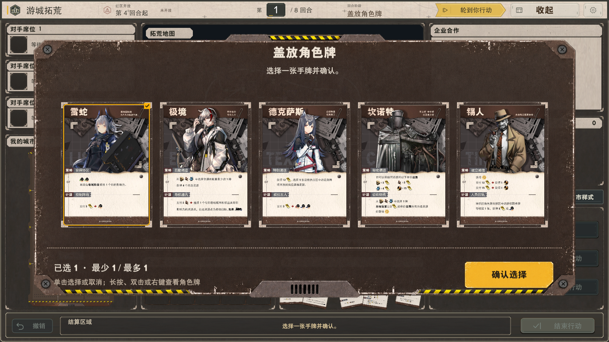

# Card-Picker-UI-v1 完整视觉补齐

日期：2026-09-27。

此前 UI-007／UI-008 的准确状态是：选择、选中、详情及真实盖牌确认功能已接入，但只采用原包的选中框；底板、卡槽与横向列表未落实。不能将当时的功能验证记为原包完整视觉完成。本次专门补齐这一缺口。

## 资产与实际入口

- 新增 `Assets/YC/Presentation/Prefabs/Gameplay/Dialogs/CardPickerDialog.prefab`，通过两张对局场景共用的 `GameplayInteractionHud.prefab` 中 Registry 的 `cardPickerPrefab` 引用。HUD 仅增加这一个资产引用，不修改场景覆盖。
- 窗口底板、普通卡槽、横向轨道及滑块从原 ZIP 按原字节导入 `Assets/YC/Presentation/CardPicker/Artwork/`；选中框和主／次按钮复用现有原包资源，七张图片均有 SHA-256 核对，见 [素材与范围校验](卡牌选择/素材与范围校验.json)。
- `EffectDialogShellView` 继续提供选择与详情所需引用，但卡牌页由独立预制体定义全部外观，不再借用通用壳框体、卡底或纵向网格。普通文本、资源、特殊设施拖放页仍走原通用壳；原壳预制体字节不变。
- 角色／设施选择根据正式候选是否具有原图分流。盖牌仍从 `RefreshCharacterCoverSelection → ShowCoverSelection` 进入，保留阶段页、当前候选与权限、预选草稿、确认及重复提交锁。弃牌查看复用同一卡牌展示，保持只读且没有确认提交。
- 8 个非局内原文件与本轮开始时的哈希一致。没有回退其他任务已有工作，没有修改启动、加载、房间或收藏室界面。

## 原包构图与适配

窗口保持 1774×887、2:1，由实际 ContentRect 内的原生布局和 AspectRatioFitter 约束；页头、内容、页脚用 VLG，底部按钮和卡牌行用 HLG。卡牌测量器只提供 LayoutElement 输入，位置由原生布局负责。

基准 1920×1080 的内容视口为 1582×482；2／6／7 张卡面分别为 288×408、216×306、180×255。超过 7 张采用 180×255 的单行横向滚动，9 张内容宽 2038、滚动距离 456。窄视口保持可读卡宽并在内容区内滚动，不换成纵向网格。七张及以下无需额外的两侧内容缓冲，原生居中自然形成留白，避免 16:10 下亚像素溢出误显滚动条。

卡槽与选中框分别依据原包的源安全框映射，卡面保持 12:17；装饰与卡图随同一内容容器滚动。按钮和滚动条按原包可见框采样，透明外画布不扩大点击区。卡面选择与详情按钮独立。原包没有详情入口，本次保留现有详情能力，在每张卡牌下方放置独立按钮。

相对原包全屏居中，窗口在当前 ContentRect 居中：1920×1080 整体上移 15 像素，保证常驻顶底栏仍可见、可操作。标题和按钮使用强调字体，说明使用正文字体，选择计数中的数字使用既有数字字体角色；只读提示与选择提示均在预制体中序列化。

## 验证与边界

最终定向 [EditMode 52/52 通过](卡牌选择/CardPicker-EditMode.xml)：新卡牌页 13 项、角色选择生命周期 32 项、原通用壳布局回归 7 项。覆盖卡面比例、横向末项、详情返回保留草稿与滚动、确认只提交一次、只读无确认，以及文本／资源／特殊设施页继续使用原壳。

最终 [PlayMode 3/3 通过](卡牌选择/CardPicker-PlayMode.xml)：正常入场推进到盖牌、预选、详情与返回、拒绝重试及确认，在 SampleScene 和 ThreePlayerScene 均执行；卡面、详情和确认按钮验证实际首个射线命中。另验证从实际卡面冒泡的滚轮事件，以及按实际屏幕坐标拖动滑块到右端后的末项与详情可达；只读弃牌入口回归通过。

已复核 7 组组件图和 2 张正式盖牌图。组件图使用正式角色纹理循环构成 2／6／7／9 张样本，明确标为诊断，不代表合法手牌数量或规则提交；两张 `FormalCover` 图来自上述真实正常入场用例的选牌状态。组件矩阵覆盖 1920×1080、900×600、1920×1200，九张末项完整可见，16:10 七张无多余滚动条。逐图来源、矩形及审查见 [视觉核对](卡牌选择/CardPicker-Visual-Review.json)。正式页面示例：

上述验证不替代多客户端联机和全部手柄操作验收。可选截图标志 `--yc-capture-card-picker` 需要非 batchmode 的 Game View；首轮在 batchmode 中未产出截图的记录保留，最终改为正常渲染后两图成功。

扩大设施回归首轮为 19/26 通过（[完整首轮结果](卡牌选择/CardPicker-ExpandedRegression.xml) 共 71/78）；7 项失败涉及未变更原壳的旧颜色、层级数字和布局刷新前尺寸断言。基线代码及原壳哈希核对显示：3 项颜色期望早已与 `AddOptions` 的既有灰色设置不符，1 项层级仍期望 119 而既有 Page 为 118，3 项尺寸在原生布局刷新前读取旧的 600。这些路径未进入新增卡牌分流；未为本次视觉修复删除断言，也未宣称设施折叠流程已通过。

手动素材搭建只调用 `CardPickerAssetSetup.BuildAuthorizedCardPicker`，目标限于新卡牌预制体、四张缺失素材和 HUD 的新引用。普通启动、测试、截图及构建不调用该工具。截图工具只读取实际场景来源并操作运行实例。
