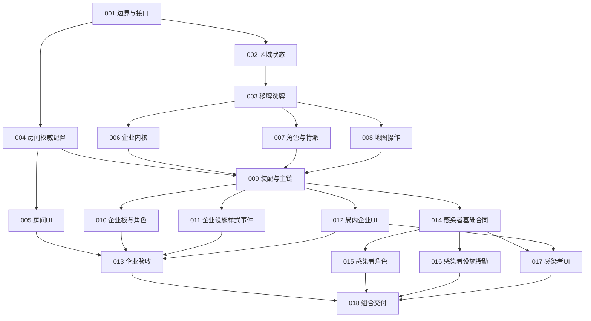

# 企业扩与感染者基础实装提示词

2026-10-02审阅，2026-10-03细化执行合同。状态：**计划已编写，18项实施任务均未开始**。本轮审阅和文档纠正不是代码交付，不改变NMC-014A/NMC-015的验收状态。

## 目标与范围

在现有Lua Effect树、Host权威及当前Unity资产上，完整接入企业扩、非企业家感染者和Room UI v1.1房间配置。目标组合为基础、基础＋企业、基础＋企业＋感染者；覆盖2/3/4人规则，地图选择与人数规则分别保存。企业家能力、抉择、帮派、图纸、层叠设施和特殊计分不在本组实现范围；其房间模式保留独立配置维度，本阶段不可启动尚未实现的企业家模式。

先读[审阅结论与待处理项](01-审阅结论与待处理项.md)、[共同执行约束](00-共同执行约束.md)、[房间UI接入合同](02-房间UI接入合同.md)和[内容与验收覆盖矩阵](03-内容与验收覆盖矩阵.md)，再指派对应任务。原始资料在[企业规格](../../游城拓荒/企业扩/卡面效果与Effect式.md)、[感染者规格](../../游城拓荒/感染者扩/卡面效果与Effect式.md)、[流程](../../游城拓荒/可选扩展包游戏流程变化.md)、[共同改动清单](../../游城拓荒/可选扩展包实装改动清单.md)。

## 严格执行合同

所有执行者必须读取当前任务的完整内容，包括末尾“逐项执行卡”；不能只拿README的任务标题开工。

| 合同 | 内容 |
| --- | --- |
| [04 文件路径与归属](04-路径索引与实施文件归属.md) | 已核实源文件、指定新增文件、共享文件唯一负责人 |
| [05 状态与命名](05-状态模型与命名合同.md) | 类型/变量/区域ID、唯一事实源、生命周期字段及禁止任务号命名 |
| [06 Effect接口](06-Effect接口与提交合同.md) | 现有执行器签名、新API参数/typeId/返回值/错误码/恢复阶段 |
| [07 内容定义](07-内容定义与注册合同.md) | 62行具体定义加公路、精确文件命名、schema/配方/replaces/能力ID |
| [08 房间与局内UI接口](08-房间与局内UI接口合同.md) | 配置/座位/请求/服务签名、结算槽投影/命令、实际资产 |
| [09 检查与交付](09-执行检查与交付模板.md) | 实施顺序、测试命令、命名检查、报告固定地址与栏目 |

**严禁用任务序号命名代码、脚本、测试、协议ID、Unity物体、资产、日志或工具。**任务编号仅是本文排程标签；执行产物必须用业务名称。接口核验任务负责验证固定合同是否兼容，不授权后续任务自由改名。

## 任务与硬依赖

依赖指前置合同和交付已完成并可读取；只写过设计、只存在类型名、历史测试通过，均不算前置完成。表中编号均为本组`EXP-xxx`，不延用NMC编号。

| 任务 | 实施提示词 | 硬依赖 | 主要产物 |
| --- | --- | --- | --- |
| EXP-001 | [生产边界与接口定稿](EXP-001-生产边界与接口定稿.md) | 无 | 当前调用审计、接口/ID/版本合同、风险与文件归属 |
| EXP-002 | [区域物品与状态底座](EXP-002-区域物品与状态底座.md) | 001 | 四根区域、稳定实例、物理类型与操作域、投影/迁移 |
| EXP-003 | [移牌洗牌与供应原语](EXP-003-移牌洗牌与供应原语.md) | 002 | 通用转移、洗牌、稳定供应槽、有界次数组合、旧API显式适配 |
| EXP-004 | [房间配置与权威同步](EXP-004-房间配置与权威同步.md) | 001 | 地图/扩展/规则模式、座位、准备及启动快照 |
| EXP-005 | [房间界面素材与接线](EXP-005-房间界面素材与接线.md) | 004 | Room v1.1实际房间资产与配置交互 |
| EXP-006 | [企业等级科室与特效内核](EXP-006-企业等级科室与特效内核.md) | 003 | 升级/到达奖励、共享科室、特效选择与冻结 |
| EXP-007 | [角色生命周期与特派](EXP-007-角色生命周期与特派.md) | 003 | 普通/持续/一次性、牌载区、普通特派、双发与新盖牌合同 |
| EXP-008 | [影响力公路与地图操作域](EXP-008-影响力公路与地图操作域.md) | 003 | 真实离场、替换、主体过滤、公路、token拓扑接口 |
| EXP-009 | [内容装配与开局回合主链](EXP-009-内容装配与开局回合主链.md) | 004、006、007、008 | 按局装配、入场、人数差异、时点及结算主干 |
| EXP-010 | [企业板科室与角色内容](EXP-010-企业板科室与角色内容.md) | 009 | 8企业、3科室、8干员、山和玛恩纳 |
| EXP-011 | [企业设施样式与事件内容](EXP-011-企业设施样式与事件内容.md) | 009 | 3办事处、6样式、2替换事件及准确素材绑定 |
| EXP-012 | [局内企业与持续区域界面](EXP-012-局内企业与持续区域界面.md) | 009 | 企业/科室/特派/持续区与现有交互页面接线 |
| EXP-013 | [企业扩整合验收](EXP-013-企业扩整合验收.md) | 005、010、011、012 | 企业正式清单、实际完整对局及恢复证据 |
| EXP-014 | [感染者装配企业与公司规则](EXP-014-感染者装配企业与公司规则.md) | 009 | 感染者设置/回合增量、3企业、公司与合约 |
| EXP-015 | [感染者角色流形与结算插入](EXP-015-感染者角色流形与结算插入.md) | 014 | 9角色、3流形、锁定/永久token、底栏结算请求 |
| EXP-016 | [感染者设施样式与授勋](EXP-016-感染者设施样式与授勋.md) | 014 | 6普通设施实体、3样式、4授勋生命周期 |
| EXP-017 | [感染者局内界面整合](EXP-017-感染者局内界面整合.md) | 012、014 | 新盖牌/流形/公司/token/结算槽真实投影与交互 |
| EXP-018 | [组合联机恢复与交付验收](EXP-018-组合联机恢复与交付验收.md) | 013、015、016、017 | 感染者正式清单、组合矩阵、联机/恢复/视觉与交付记录 |

## 依赖图

## 可并行安排

| 波次 | 可同时推进 | 必须串行的收口 |
| --- | --- | --- |
| A | 001完成后，002与004分别推进 | 001核验05—08固定合同、生产入口及文件负责人 |
| B | 003与005可并行（各自前置完成后） | 005只操作房间资产，不碰局内HUD |
| C | 006、007、008可并行 | 宿主构造器、GameState/DTO/克隆文件由集成人按接口增量串行合入 |
| D | 009完成后，010、011、012、014可并行 | 正式pack/素材总清单暂由013管理；014登记感染者内容待018收口 |
| E | 015、016、017可并行，013同时完成企业验收 | 017等待012交接HUD资产；015只产出结算请求/投影，不修改HUD资产 |
| F | 018统一整合与交付 | 正式清单、主链、序列化版本、Unity完整测试和Player构建串行 |

并行表示依赖许可，不表示可以同时改同一文件。共享的`GameState`、DTO、克隆/投影、`MoonSharpLuaRuntimeHost`、注册器、`pack.json`、素材总清单、场景和Prefab设单一负责人；其他任务交付增量建议，由负责人串行合入后才能验收。010/011/015/016分别编写独立定义与Lua文件，并提交待登记列表；不多人抢写同一清单。不得同时运行多个Unity进程使用同一checkout。

### 前置交付与最终集成验收分开判定

禁止为了满足前置任务而等待它自己的后继，形成隐含循环：

| 任务 | 本任务必须完成后才能交给后继 | 必须留给内容齐备后的集成验收 |
| --- | --- | --- |
| 009 | 实际装配/主链/配方接口可执行；使用明确标记的测试定义验证人数与时序；基础局真实可运行 | 010/011企业真实内容完整开局由013验收；感染者全部真实内容由018验收 |
| 014 | 三企业/公司规则和感染者配方完成；使用测试目录中行为完整的角色/奖励定义验证所需接口；缺正式内容时生产组合仍拒绝启动 | 无罗德岛时实际阿米娅特派、全部16干员/3流形/6设施/4授勋一起开局，需015/016交付，由018验收 |
| 017 | 按007/014固定DTO接好实际资产和命令，受控投影验证权限、引用、显示及提交；无来源数据不显示假可用 | 015/016真实内容驱动的阿米娅/杰西卡/授勋完整交互由018验收 |

这些后置证据在报告内写明“集成待验—由013/018执行”，不能标记已通过；也不阻断已达到上列合同交付条件的后继启动。测试定义只放指定测试目录，必须能真实执行所测子树，不得用空脚本、生产占位牌或硬编码结果骗过能力校验。013/018最终交付前逐项清零，不能把它们永久留作“后续完善”。

## 交付与执行方法

每次指派提供当前任务提示词的完整绝对路径，例如`G:\NoMadCity\prompt\企业扩与感染者基础实装\EXP-002-区域物品与状态底座.md`，要求执行者完整读取该文档的“逐项执行卡”和全部必读地址，按05—08固定接口/字段实现，按09填写指定报告。这段文字用于后续指派，本次没有启动这些实施任务。

执行记录命名`执行记录/任务业务名-执行记录.md`（任务编号只写报告元数据），记录输入版本、修改范围、API变更、卡牌覆盖、测试/视觉/恢复证据和剩余项。任务状态只根据证据更新。013代表企业子集验收，018代表本组全部目标验收；二者均不自动代表NMC-015或企业家模式完成。
