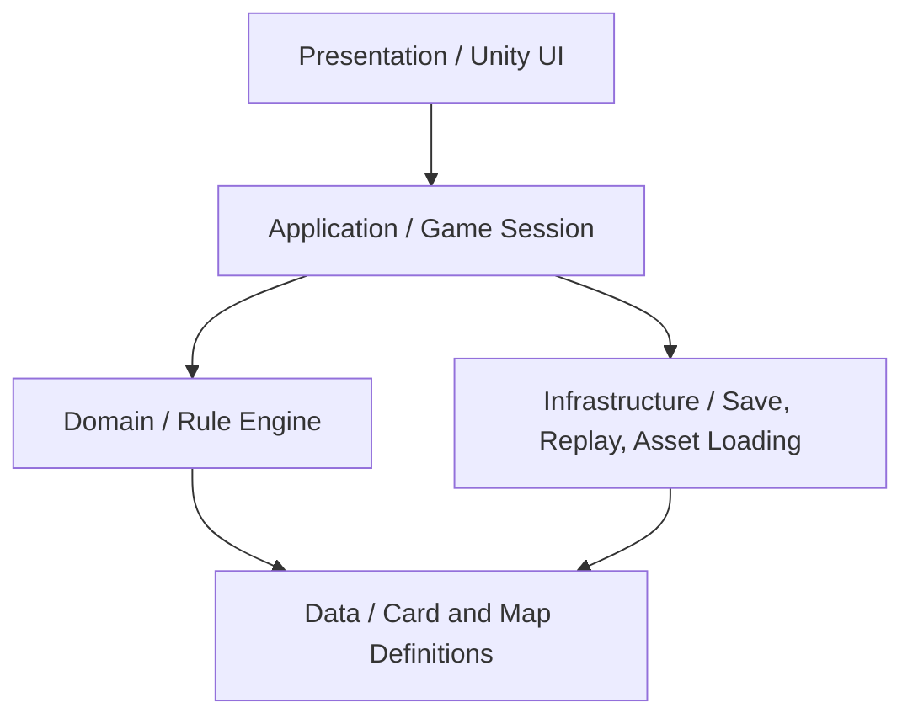
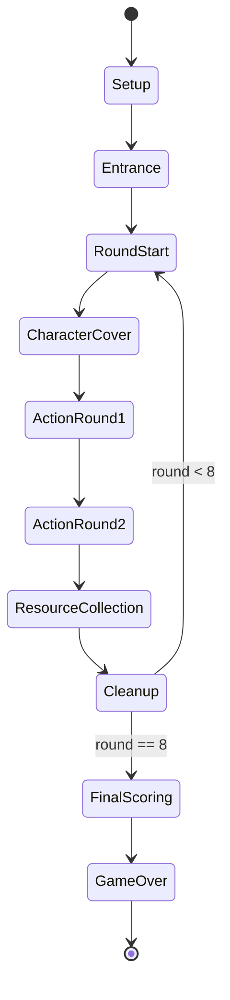
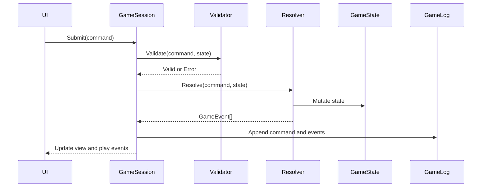

# 2D Unity 模拟器总体架构

本文描述《游城拓荒：铸基者》基础版玩法在 Unity 2D 模拟器中的总体架构。设计重点是：规则正确、流程清晰、数据可配置、表现层和规则层解耦。

## 1. 架构目标

- 能完整模拟基础版 3 到 4 人游戏。
- 支持开局入场、8 回合拓荒探索、采集资源、收尾、最终计分。
- 支持主要行动、快速行动、角色牌、事件牌、设施牌、城市样式牌。
- 自动处理费用、路径、资源、影响力、计分等结算。
- 所有玩家操作可记录、可回放、可测试。
- 后续可以扩展企业扩展版规则，而不推翻基础架构。

## 2. 分层架构



### Presentation

负责显示和交互，不直接改规则状态。

- 地图视图。
- 卡牌视图。
- 玩家资源面板。
- 行动选择面板。
- 结算预览面板。
- 日志与回放面板。

### Application

负责组织一局游戏的生命周期。

- 创建新游戏。
- 读取规则数据。
- 发送玩家命令。
- 调用规则引擎验证和结算。
- 分发 UI 动画事件。
- 维护存档和回放。

### Domain

纯 C# 规则核心，不依赖 Unity 场景。

- 游戏状态。
- 回合状态机。
- 命令校验。
- 行动结算。
- 路径与费用计算。
- 卡牌效果系统。
- 最终计分。

### Data

存放地图、卡牌、资源、图标、美术引用等定义。

- ScriptableObject。
- JSON 配置。
- CSV 或表格导入可选。

### Infrastructure

负责非玩法核心能力。

- 存档读写。
- 回放序列化。
- 配表加载。
- 资源包加载。
- 调试工具。

## 3. 核心模块

### GameSession

一局游戏的入口对象。

- 持有 `GameState`。
- 持有当前 `PhaseState`。
- 接收 `GameCommand`。
- 调用 `CommandValidator`。
- 调用 `CommandResolver`。
- 产生 `GameEvent` 给 UI 和日志。

### GameState

完整描述当前局面，必须可序列化。

- 当前阶段。
- 当前回合数，基础版为 1 到 8。
- 当前起始玩家。
- 当前行动玩家。
- 当前行动轮次。
- 玩家列表。
- 地图状态。
- 牌堆与弃牌区。
- 设施供应区。
- 城市样式牌状态。
- 待处理选择。
- 日志。

### PlayerState

表示单个玩家的所有可变数据。

- 玩家颜色和座次。
- 金券、源岩、源石、异铁、至纯源石。
- 移动城市所在资源点。
- 影响力供应堆。
- 手牌。
- 本回合盖放角色牌。
- 角色牌弃牌区。
- 已建设设施。
- 已宣告城市样式。
- 当前分数与计分项。

### BoardState

表示地图上所有可变状态。

- 每个资源点的开放状态。
- 每个资源点的事件牌。
- 每个资源点的资源指示物。
- 每个资源点上的影响力。
- 每条航道上的影响力。
- 每个资源点是否有移动城市停靠。
- 每个区块的控制归属缓存。

### Definition Database

集中查询所有静态规则数据。

- `MapDefinition`
- `ResourceNodeDefinition`
- `RouteDefinition`
- `RegionDefinition`
- `CardDefinition`
- `EffectDefinition`
- `ScoringDefinition`

## 4. 游戏流程状态机



### Setup

- 创建玩家。
- 选择 3 人或 4 人地图面。
- 洗切事件牌。
- 准备城市样式牌、设施牌堆、设施供应区。
- 初始化资源供应堆、回合标记、胜利点轨道。

### Entrance

- 决定起始玩家。
- 玩家按顺序选择不同的绿色资源点作为初始资源点。
- 放置移动城市。
- 翻开对应绿色事件牌，放置资源点指示物。
- 玩家选择事件区选项并获得奖励。
- 按座次获得初始资金。

### RoundStart

- 设置本回合起始玩家。
- 重置本回合行动状态。
- 进入角色牌盖放。

### CharacterCover

- 每名玩家从手牌选择 1 张角色牌背面朝上盖放。
- 如果没有手牌，则回收弃牌区角色牌后再盖放。
- 本回合只能使用盖放的角色牌。

### ActionRound1 和 ActionRound2

每回合有两轮玩家行动。每轮从起始玩家开始，按顺时针依次行动。

玩家行动窗口：

- 主要行动前可执行任意快速行动。
- 执行 1 个主要行动。
- 主要行动后可执行任意快速行动。
- 本轮行动结束，轮到下一位玩家。

主要行动：

- 部署：放置 1 个影响力。
- 调度：移动 1 个影响力，执行 2 次。
- 探索：支付路费，结算事件，在目标资源点放置影响力。
- 城市移动：支付 3 源石，移动城市，在出发点放置影响力。
- 建设：支付费用，放置设施牌并结算分数和入场效果。
- 特殊行动：使用已宣告城市样式解锁的特殊行动。

快速行动：

- 使用角色牌。
- 宣告城市样式。

### ResourceCollection

- 两轮玩家行动结束后进入采集资源。
- 每名玩家可以选择任意数量的自己有影响力或移动城市停靠的资源点。
- 支付连接移动城市所在地与所选资源点的路费。
- 每个资源点每次采集只获得一次其资源指示物对应的资源。
- 采集阶段每条航道只需要支付一次路费，即使连接多个资源点。
- 不能使用本采集阶段刚获得的金券支付该阶段路费。

### Cleanup

- 结算收尾阶段效果。
- 复位城市样式标记。
- 传递起始玩家标记。
- 移动回合标记。
- 若未满 8 回合，则进入下一回合。

### FinalScoring

- 结算区块控制。
- 结算剩余资源。
- 结算设施相关分数。
- 结算城市样式相关分数。
- 统计最终分数。
- 分数最高者获胜。
- 平局时依次比较剩余金券、剩余至纯源石数量；仍相同则共同胜利。

## 5. 命令系统

所有玩家操作都用命令表达。

```csharp
public interface IGameCommand
{
    string CommandId { get; }
    string PlayerId { get; }
}
```

建议的命令类型：

- `ChooseStartPlayerCommand`
- `ChooseInitialResourceNodeCommand`
- `ResolveEntranceEventCommand`
- `CoverCharacterCardCommand`
- `DeployInfluenceCommand`
- `MoveInfluenceCommand`
- `ExploreResourceNodeCommand`
- `MoveCityCommand`
- `BuildFacilityCommand`
- `UseCharacterCardCommand`
- `DeclareCityPatternCommand`
- `UseSpecialActionCommand`
- `CollectResourcesCommand`
- `ResolvePendingChoiceCommand`
- `EndActionCommand`

每个命令都走同一条流水线：



## 6. 行动结算架构

### Validator

负责回答“能不能做”。

- 当前阶段是否允许。
- 当前玩家是否有行动权。
- 资源是否足够。
- 目标是否开放。
- 影响力槽是否为空。
- 路径是否存在。
- 是否满足城市样式宣告条件。
- 是否满足设施关键字限制。

### Resolver

负责回答“做了会发生什么”。

- 扣除资源和金券。
- 移动城市或影响力。
- 放置或移除影响力。
- 翻开事件牌。
- 放置资源点指示物。
- 建设设施。
- 结算入场效果。
- 增加分数。
- 产生待处理选择。

### PendingChoice

有些规则不能自动决定，需要玩家选择。

- 探索时选择路径。
- 航道上有多个对手影响力时，选择向谁支付。
- 事件牌有多个事件选项时，选择一个选项。
- 角色牌有策略和计谋时，选择其一。
- 多个收尾效果同时触发时，选择结算顺序。

`PendingChoice` 应保存在 `GameState` 中，直到玩家提交 `ResolvePendingChoiceCommand`。

## 7. 路径与地图服务

### BoardGraphService

提供地图图查询。

- 查询相邻资源点。
- 查询资源点所在区块。
- 查询连接两个资源点的航道。
- 查询资源点和航道上的影响力槽。
- 查询移动城市当前位置。

### RouteCostService

提供费用计算和路径枚举。

- 根据起点和目标点列出可用路径。
- 计算探索路费。
- 计算采集资源路费。
- 计算航道上对手影响力的支付对象。
- 标记本次采集阶段已经支付过的航道。

### RegionControlService

提供区控计算。

- 统计区块内各玩家影响力。
- 移动城市在区块内视为 2 个影响力。
- 判断控制者。
- 处理并列或无人控制。
- 根据区块颜色和分值表给分。

## 8. 效果系统

### EffectDefinition

效果定义由触发器、条件、费用和操作组成。

```csharp
public sealed class EffectDefinition
{
    public EffectTrigger Trigger;
    public List<ConditionDefinition> Conditions;
    public ResourceCost Cost;
    public List<EffectOperation> Operations;
}
```

### EffectTrigger

常见触发点：

- `OnCharacterCardUsed`
- `OnEventResolved`
- `OnFacilityBuilt`
- `OnFacilityEntered`
- `OnCityPatternDeclared`
- `OnSpecialActionUsed`
- `OnResourceCollection`
- `OnCleanup`
- `OnFinalScoring`

### EffectOperation

常见操作：

- `GainResource`
- `PayResource`
- `GainScore`
- `PlaceInfluence`
- `MoveInfluence`
- `RemoveInfluence`
- `MoveCity`
- `DrawCard`
- `RevealCard`
- `BuildFacility`
- `MarkCityPattern`
- `UnlockSpecialAction`

### 为什么需要效果系统

基础版里已经存在角色牌、事件、设施入场效果和城市样式宣告效果。如果全部硬编码在行动里，后续企业扩展版会非常难维护。效果系统可以让普通效果数据化，少数特殊效果再用专用 resolver 处理。

## 9. 数据文件建议

### Unity 项目目录

```text
Assets/
  Scripts/
    Domain/
    Application/
    Presentation/
    Infrastructure/
    Tests/
  Data/
    Maps/
    Cards/
    Effects/
    Scoring/
  Art/
    Board/
    Cards/
    Tokens/
    UI/
  Scenes/
    Bootstrap.unity
    Game.unity
    Debug.unity
```

### 地图定义示例

```json
{
  "nodes": [
    {
      "id": "B-01",
      "region": "B",
      "color": "Green",
      "resourceSlots": 1,
      "influenceSlots": 2,
      "canDockCity": true
    }
  ],
  "routes": [
    {
      "id": "B-01_B-02",
      "from": "B-01",
      "to": "B-02",
      "influenceSlots": 2
    }
  ],
  "regions": [
    {
      "id": "B",
      "score": 3,
      "nodeIds": ["B-01", "B-02", "B-03"]
    }
  ]
}
```

### 卡牌定义示例

```json
{
  "id": "facility_core_command_tower",
  "type": "Facility",
  "name": "核心指挥塔",
  "color": "Green",
  "score": 0,
  "cost": {
    "money": 18
  },
  "onEnterEffects": [
    {
      "operation": "GainResource",
      "resource": "SourceStone",
      "amount": 1
    }
  ]
}
```

## 10. UI 架构

### View 和 Presenter

Unity 组件只负责显示，Presenter 负责把 `GameState` 转成界面状态。

- `BoardView`：显示地图底图、资源点、航道、影响力、移动城市。
- `CardView`：显示角色牌、事件牌、设施牌、城市样式牌。
- `PlayerPanelView`：显示资源、分数、手牌、已建设施。
- `ActionPanelView`：显示当前可执行行动。
- `ChoiceDialogView`：显示待处理选择。
- `LogView`：显示操作和结算记录。

### 交互原则

- UI 只提交命令，不直接修改状态。
- UI 从规则引擎获得合法行动列表。
- UI 高亮合法目标。
- UI 显示非法原因。
- UI 在确认前显示费用和结果预览。

## 11. 存档与回放

### 存档

保存 `GameState` 和数据版本。

```json
{
  "version": "0.1.0",
  "ruleset": "basic",
  "state": {}
}
```

### 回放

保存初始随机种子和命令序列。

```json
{
  "seed": 1024,
  "ruleset": "basic",
  "commands": []
}
```

回放价值：

- 复现 bug。
- 做规则回归测试。
- 支持观战和战报。
- 未来支持联网同步。

## 12. 扩展点

### 企业扩展版

预留规则开关：

- `RuleSet.Basic`
- `RuleSet.EnterpriseExpansion`

扩展内容不要直接塞进基础版流程，而是通过以下方式接入：

- 新增阶段。
- 新增命令。
- 新增效果触发器。
- 新增卡牌定义。
- 新增校验规则。

### AI 玩家

AI 不需要特殊权限，它和 UI 一样提交命令。

- 从规则引擎获取合法命令。
- 用评分函数选择命令。
- 可先做贪心 AI，再做 Monte Carlo 模拟。

### 联机同步

如果后续要联网，规则引擎需要满足：

- 所有随机都来自同一个 seed。
- 所有命令可序列化。
- 所有状态变更由命令产生。
- 表现层动画不影响规则状态。

## 13. 关键架构约束

- 规则核心不能依赖 Unity 场景对象。
- 所有状态必须可序列化。
- 所有玩家操作必须先校验再结算。
- 所有随机行为必须可复现。
- 卡牌效果优先数据化。
- 地图热点坐标和地图规则节点分离。
- UI 只负责展示和提交命令，不写玩法规则。

## 14. MVP 范围

第一版最小可用模拟器建议包含：

- 3 到 4 人热座。
- 基础地图。
- 开局入场。
- 8 回合流程。
- 部署、调度、探索、城市移动、建设。
- 简化但正确的资源采集。
- 基础事件牌。
- 基础设施牌。
- 最终计分。
- 操作日志。

暂缓内容：

- 完整动画。
- AI。
- 联机。
- 复杂美术还原。
- 企业扩展版。
- 完整新手引导。

这样可以最快验证规则模型是否成立，再逐步把体验做厚。
